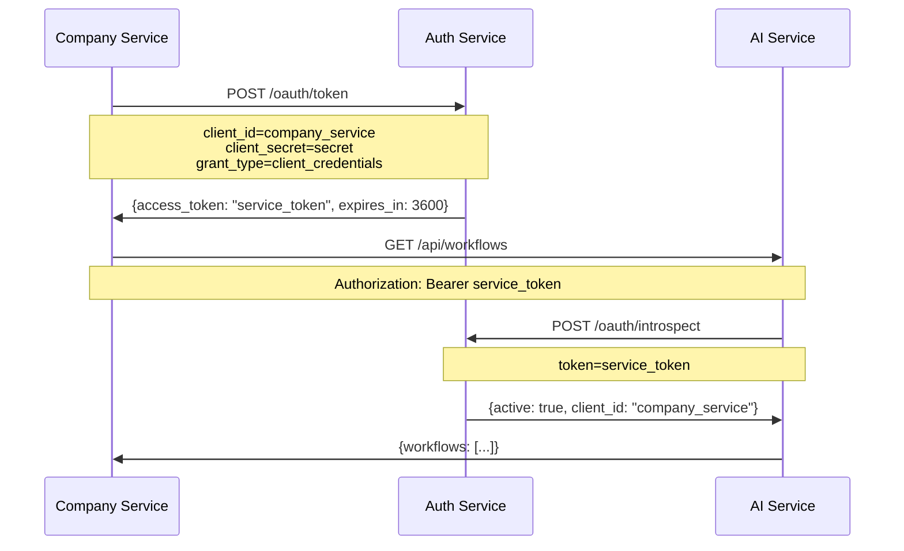

# Client Credential OAuth for Service-to-Service Authentication

## Overview

This document explains the implementation of **OAuth 2.0 Client Credentials** flow for service-to-service authentication in the AI Agent Platform. This is specifically designed for **machine-to-machine (M2M)** communication without user involvement.

## Key Concepts

### What is Client Credential OAuth?

Client Credential OAuth is an OAuth 2.0 flow designed for:
- **Service-to-service communication** (no user context)
- **Machine-to-machine authentication**
- **Long-lived credentials** with automatic token refresh
- **Secure API access** between microservices

### How It Differs from User-Based JWT

| Aspect | User JWT | Client Credential OAuth |
|--------|----------|-------------------------|
| **Context** | User authentication | Service authentication |
| **Token Life** | Short-lived (15 min) | Longer-lived (1 hour) |
| **Refresh** | User must refresh | Automatic service refresh |
| **Scopes** | User permissions | Service capabilities |
| **Audience** | Frontend users | Backend services |

## Architecture



## Implementation Details

### 1. Database Schema

#### Client Credentials Table
```sql
CREATE TABLE client_credentials (
    id VARCHAR(36) PRIMARY KEY,
    client_id VARCHAR(255) UNIQUE NOT NULL,
    client_secret_hash VARCHAR(255) NOT NULL,
    client_name VARCHAR(255) NOT NULL,
    description TEXT,
    scopes TEXT NOT NULL, -- JSON array
    is_active BOOLEAN DEFAULT TRUE,
    expires_at TIMESTAMP NULL,
    last_used_at TIMESTAMP NULL,
    created_at TIMESTAMP DEFAULT CURRENT_TIMESTAMP,
    updated_at TIMESTAMP DEFAULT CURRENT_TIMESTAMP ON UPDATE CURRENT_TIMESTAMP
);
```

#### Service Tokens Table
```sql
CREATE TABLE service_tokens (
    id VARCHAR(36) PRIMARY KEY,
    token_hash VARCHAR(255) UNIQUE NOT NULL,
    client_id VARCHAR(255) NOT NULL,
    scopes TEXT NOT NULL, -- JSON array
    expires_at TIMESTAMP NOT NULL,
    revoked_at TIMESTAMP NULL,
    revoked_reason VARCHAR(255) NULL,
    created_at TIMESTAMP DEFAULT CURRENT_TIMESTAMP
);
```

### 2. OAuth Endpoints

#### Token Endpoint
```http
POST /oauth/token
Content-Type: application/json

{
  "grant_type": "client_credentials",
  "client_id": "company_service",
  "client_secret": "company_secret_123",
  "scope": "read write"
}
```

**Response:**
```json
{
  "access_token": "eyJhbGciOiJIUzI1NiIsInR5cCI6IkpXVCJ9...",
  "token_type": "Bearer",
  "expires_in": 3600,
  "scope": "read write"
}
```

#### Token Introspection Endpoint
```http
POST /oauth/introspect
Content-Type: application/json

{
  "token": "eyJhbGciOiJIUzI1NiIsInR5cCI6IkpXVCJ9..."
}
```

**Response:**
```json
{
  "active": true,
  "client_id": "company_service",
  "scope": "read write",
  "exp": 1640995200,
  "iat": 1640991600,
  "sub": "company_service"
}
```

### 3. Service Integration

#### Company Service OAuth Client
```typescript
@Injectable()
export class OAuthClientService {
  async getAccessToken(): Promise<string> {
    // Check cached token
    if (this.currentToken && this.isTokenValid()) {
      return this.currentToken;
    }

    // Request new token
    const response = await this.httpClient.post('/oauth/token', {
      grant_type: 'client_credentials',
      client_id: this.configService.get('OAUTH_CLIENT_ID'),
      client_secret: this.configService.get('OAUTH_CLIENT_SECRET'),
      scope: 'read write'
    });

    this.currentToken = response.data.access_token;
    this.tokenExpiresAt = Date.now() + (response.data.expires_in * 1000);
    
    return this.currentToken;
  }
}
```

#### Service Auth Guard
```typescript
@Injectable()
export class ServiceAuthGuard implements CanActivate {
  async canActivate(context: ExecutionContext): Promise<boolean> {
    const token = this.extractTokenFromHeader(request);
    
    // Try OAuth service token first
    const serviceValidation = await this.oauthClientService.introspectToken(token);
    if (serviceValidation.active) {
      request.service = {
        client_id: serviceValidation.client_id,
        scopes: serviceValidation.scope?.split(' ') || [],
        type: 'service'
      };
      return true;
    }

    // Fall back to user JWT validation
    const user = await this.authClientService.validateToken(token);
    request.user = user;
    return true;
  }
}
```

## Usage Examples

### 1. Service-to-Service API Call

```typescript
// Company service calling AI service
@Injectable()
export class WorkflowService {
  constructor(private oauthClient: OAuthClientService) {}

  async createWorkflow(workflowData: any) {
    const token = await this.oauthClient.getAccessToken();
    
    const response = await axios.post('http://ai-service:8000/api/workflows', workflowData, {
      headers: {
        'Authorization': `Bearer ${token}`,
        'Content-Type': 'application/json'
      }
    });
    
    return response.data;
  }
}
```

### 2. Protected Endpoint with Service Auth

```typescript
@Controller('workflows')
export class WorkflowsController {
  @Post()
  @UseGuards(ServiceAuthGuard) // Accepts both user and service tokens
  async createWorkflow(@Request() req: any, @Body() workflowData: any) {
    if (req.service) {
      // Service-to-service call
      console.log(`Service ${req.service.client_id} creating workflow`);
      return this.workflowService.createWorkflow(workflowData);
    } else if (req.user) {
      // User-initiated call
      console.log(`User ${req.user.id} creating workflow`);
      return this.workflowService.createWorkflowForUser(req.user.id, workflowData);
    }
  }
}
```

### 3. Admin Management of Client Credentials

```typescript
// Create new client credential (Admin only)
POST /oauth/clients
{
  "client_name": "new_service",
  "description": "New microservice",
  "scopes": ["read", "write"],
  "expires_at": "2024-12-31T23:59:59Z"
}

// List all client credentials (Admin only)
GET /oauth/clients

// Revoke service token (Admin only)
POST /oauth/revoke
{
  "token": "eyJhbGciOiJIUzI1NiIsInR5cCI6IkpXVCJ9...",
  "reason": "Security incident"
}
```

## Security Considerations

### 1. Token Security
- **Short expiration**: Service tokens expire in 1 hour
- **Token revocation**: Tokens can be revoked immediately
- **Scope limitation**: Each service has specific scopes
- **Audit trail**: All token usage is logged

### 2. Client Credential Security
- **Secure storage**: Client secrets are hashed with bcrypt
- **Environment variables**: Credentials stored in environment
- **Rotation**: Credentials can be rotated without downtime
- **Access control**: Only admins can manage credentials

### 3. Network Security
- **Internal network**: Services communicate over internal Docker network
- **HTTPS**: All external communication uses HTTPS
- **Token transmission**: Tokens only sent over secure channels

## Configuration

### Environment Variables

```bash
# OAuth Client Credentials
OAUTH_CLIENT_ID=company_service
OAUTH_CLIENT_SECRET=company_secret_123

# JWT Configuration (for service tokens)
JWT_SECRET=your-super-secret-jwt-key
JWT_ACCESS_EXPIRES_IN=1h
```

### Docker Compose Configuration

```yaml
company:
  environment:
    - OAUTH_CLIENT_ID=company_service
    - OAUTH_CLIENT_SECRET=company_secret_123
    - AUTH_SERVICE_URL=http://auth-service:3000
```

## Migration from Current System

### Current State
- User-based JWT authentication
- Direct service-to-service calls
- No service-level authentication

### Migration Steps
1. **Deploy OAuth tables**: Run `03-init-oauth.sql`
2. **Update services**: Add OAuth client services
3. **Update guards**: Replace with `ServiceAuthGuard`
4. **Test integration**: Verify service-to-service calls
5. **Monitor usage**: Track token usage and performance

### Backward Compatibility
- User JWT tokens continue to work
- Existing API endpoints remain unchanged
- Gradual migration possible

## Monitoring and Debugging

### Token Usage Monitoring
```sql
-- Check active service tokens
SELECT client_id, COUNT(*) as active_tokens, 
       MAX(created_at) as latest_token
FROM service_tokens 
WHERE revoked_at IS NULL AND expires_at > NOW()
GROUP BY client_id;

-- Check client credential usage
SELECT client_id, client_name, last_used_at, 
       COUNT(*) as total_tokens_issued
FROM client_credentials cc
LEFT JOIN service_tokens st ON cc.client_id = st.client_id
GROUP BY cc.client_id;
```

### Debugging Token Issues
```bash
# Test token introspection
curl -X POST http://auth-service:3000/oauth/introspect \
  -H "Content-Type: application/json" \
  -d '{"token": "your_token_here"}'

# Check service health
curl http://auth-service:3000/health
```

## Best Practices

### 1. Token Management
- **Cache tokens**: Avoid requesting new tokens for every call
- **Handle expiration**: Implement automatic token refresh
- **Error handling**: Gracefully handle token validation failures
- **Logging**: Log token usage for audit purposes

### 2. Security
- **Rotate secrets**: Regularly rotate client secrets
- **Monitor usage**: Track unusual token usage patterns
- **Scope minimization**: Grant minimum required scopes
- **Network isolation**: Keep services on internal networks

### 3. Performance
- **Token caching**: Cache tokens with appropriate TTL
- **Connection pooling**: Reuse HTTP connections
- **Async operations**: Use async/await for token operations
- **Health checks**: Monitor OAuth service health

## Troubleshooting

### Common Issues

1. **Token Expired**
   ```
   Error: Token validation failed
   Solution: Check token expiration and refresh logic
   ```

2. **Invalid Client Credentials**
   ```
   Error: Invalid client credentials
   Solution: Verify OAUTH_CLIENT_ID and OAUTH_CLIENT_SECRET
   ```

3. **Service Unavailable**
   ```
   Error: OAuth service health check failed
   Solution: Check auth service status and network connectivity
   ```

### Debug Commands
```bash
# Check OAuth service status
docker logs auth-service

# Verify database tables
docker exec -it db-mysql mysql -u root -p auth_service -e "SHOW TABLES;"

# Test token endpoint
curl -X POST http://localhost:3001/oauth/token \
  -H "Content-Type: application/json" \
  -d '{"grant_type":"client_credentials","client_id":"company_service","client_secret":"company_secret_123"}'
```

## Conclusion

The Client Credential OAuth implementation provides a secure, scalable solution for service-to-service authentication in the AI Agent Platform. It separates user authentication from service authentication, provides better security controls, and enables fine-grained access management between microservices.

This implementation follows OAuth 2.0 standards and best practices, ensuring compatibility with industry standards while providing the specific functionality needed for microservice architecture.
