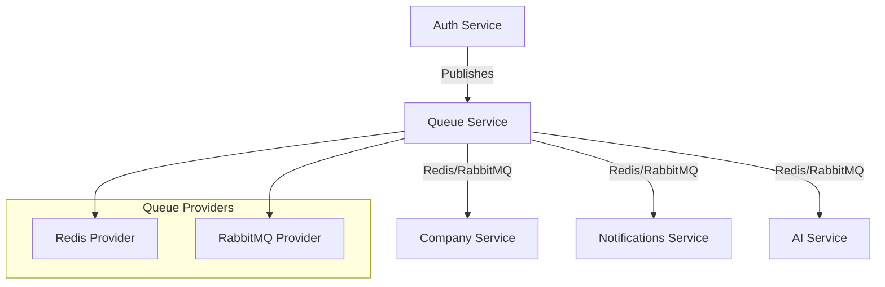
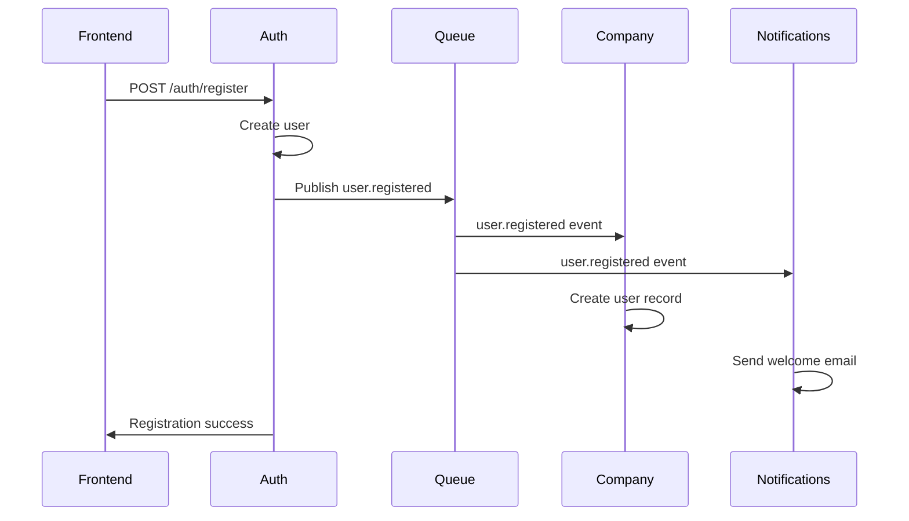
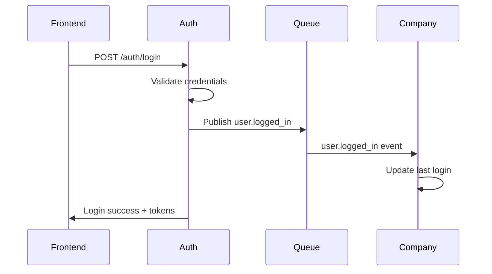

# Queue Service Implementation

## Overview

This document explains the implementation of a **dynamic queue service** with multiple providers (Redis, RabbitMQ) for the AI Agent Platform. The queue service enables asynchronous communication between microservices using pub/sub patterns.

## Architecture



## Key Features

### 1. **Dynamic Provider Support**
- **Redis**: Fast, in-memory pub/sub with persistence
- **RabbitMQ**: Enterprise-grade message broker with advanced routing
- **Extensible**: Easy to add new providers (SQS, Kafka, etc.)

### 2. **Message Management**
- **Priority Queues**: Support for urgent, high, normal, low priorities
- **Retry Logic**: Automatic retry with exponential backoff
- **Dead Letter Queues**: Failed message handling
- **Message Persistence**: Database tracking of all messages

### 3. **Event-Driven Architecture**
- **User Registration Events**: Trigger company service sync
- **User Login Events**: Update user activity tracking
- **User Logout Events**: Session management
- **Extensible Events**: Easy to add new event types

## Implementation Details

### 1. **Queue Service Components**

#### Core Service (`queue/src/queue.service.ts`)
```typescript
@Injectable()
export class QueueService implements OnModuleInit, OnModuleDestroy {
  private provider: QueueProvider;
  
  async publish(queueName: string, messageType: string, payload: any, options?: QueueOptions): Promise<string>
  async subscribe(queueName: string, handler: (message: QueueMessage) => Promise<void>): Promise<void>
  async getQueueStats(queueName: string): Promise<QueueStats>
  async retryMessage(messageId: string): Promise<void>
}
```

#### Provider Interface (`queue/src/interfaces/queue-provider.interface.ts`)
```typescript
export interface QueueProvider {
  initialize(): Promise<void>;
  publish(queueName: string, message: QueueMessage, options?: QueueOptions): Promise<void>;
  subscribe(queueName: string, handler: (message: QueueMessage) => Promise<void>): Promise<void>;
  acknowledge(messageId: string): Promise<void>;
  reject(messageId: string, error?: string): Promise<void>;
  getQueueStats(queueName: string): Promise<QueueStats>;
  healthCheck(): Promise<boolean>;
}
```

### 2. **Provider Implementations**

#### Redis Provider (`queue/src/providers/redis-queue.provider.ts`)
- **Pub/Sub**: Real-time message delivery
- **Priority Queues**: Using Redis sorted sets
- **Persistence**: Message storage in Redis hashes
- **Retry Logic**: Automatic retry with backoff

#### RabbitMQ Provider (`queue/src/providers/rabbitmq-queue.provider.ts`)
- **Durable Queues**: Message persistence
- **Priority Support**: Native priority queues
- **Dead Letter Exchanges**: Failed message handling
- **Publisher Confirms**: Guaranteed message delivery

### 3. **Database Schema**

#### Queue Messages Table
```sql
CREATE TABLE queue_messages (
    id VARCHAR(36) PRIMARY KEY,
    queue_name VARCHAR(255) NOT NULL,
    message_type VARCHAR(255) NOT NULL,
    payload JSON NOT NULL,
    status ENUM('pending', 'processing', 'completed', 'failed', 'retry') DEFAULT 'pending',
    priority ENUM('low', 'normal', 'high', 'urgent') DEFAULT 'normal',
    retry_count INT DEFAULT 0,
    max_retries INT DEFAULT 3,
    processed_at TIMESTAMP NULL,
    scheduled_at TIMESTAMP NULL,
    error_message TEXT NULL,
    metadata JSON NULL,
    created_at TIMESTAMP DEFAULT CURRENT_TIMESTAMP,
    updated_at TIMESTAMP DEFAULT CURRENT_TIMESTAMP ON UPDATE CURRENT_TIMESTAMP
);
```

## Usage Examples

### 1. **Publishing Events (Auth Service)**

```typescript
// User registration event
await this.queueClientService.publishUserRegistrationEvent({
  user_id: user.id,
  email: user.email,
  first_name: user.first_name,
  last_name: user.last_name,
  role: user.role,
  company_name: registerDto.company_name,
  company_domain: registerDto.company_domain,
});

// User login event
await this.queueClientService.publishUserLoginEvent({
  user_id: user.id,
  email: user.email,
  ip_address: loginDto.ip_address,
  user_agent: loginDto.user_agent,
});
```

### 2. **Consuming Events (Company Service)**

```typescript
// Subscribe to user events
await this.queueWorkerService.subscribeToUserEvents();

// Handle user registration
async handleUserRegistrationEvent(message: QueueMessage): Promise<void> {
  const { user_id, email, first_name, last_name, role, company_name } = message.payload;
  
  // Create user in company service
  await this.createUserInCompanyService({
    user_id,
    email,
    first_name,
    last_name,
    role,
    company_name,
  });
}
```

### 3. **API Operations**

#### Publish Message
```http
POST /queue/publish
Content-Type: application/json

{
  "queueName": "user-events",
  "messageType": "user.registered",
  "payload": {
    "user_id": "123",
    "email": "user@example.com",
    "first_name": "John",
    "last_name": "Doe"
  },
  "priority": "normal",
  "metadata": {
    "source": "auth-service",
    "version": "1.0"
  }
}
```

#### Get Queue Stats
```http
GET /queue/stats/user-events
```

#### Retry Failed Message
```http
POST /queue/retry/message-id-123
```

## Configuration

### Environment Variables

```bash
# Queue Provider
QUEUE_PROVIDER=redis  # or rabbitmq

# Redis Configuration
REDIS_HOST=redis
REDIS_PORT=6379
REDIS_PASSWORD=
REDIS_DB=1

# RabbitMQ Configuration
RABBITMQ_HOST=rabbitmq
RABBITMQ_PORT=5672
RABBITMQ_USERNAME=guest
RABBITMQ_PASSWORD=guest
RABBITMQ_VHOST=/

# Database Configuration
DB_HOST=db
DB_PORT=3306
DB_USER=queue_user
DB_PASSWORD=queue_password123
DB_NAME=queue_service
```

### Docker Compose Configuration

```yaml
queue:
  build:
    context: ./queue
    dockerfile: Dockerfile.dev
  environment:
    - QUEUE_PROVIDER=redis
    - REDIS_HOST=redis
    - REDIS_PORT=6379
    - DB_HOST=db
    - DB_PORT=3306
  depends_on: [db, redis, rabbitmq]
  ports: ["3005:3005"]
```

## Event Flow Examples

### 1. **User Registration Flow**



### 2. **User Login Flow**



## Monitoring and Debugging

### 1. **Queue Statistics**

```sql
-- Get queue stats
SELECT 
    queue_name,
    status,
    COUNT(*) as count,
    AVG(TIMESTAMPDIFF(SECOND, created_at, processed_at)) as avg_processing_time
FROM queue_messages 
WHERE created_at >= DATE_SUB(NOW(), INTERVAL 1 HOUR)
GROUP BY queue_name, status;
```

### 2. **Failed Messages**

```sql
-- Get failed messages
SELECT 
    id,
    queue_name,
    message_type,
    error_message,
    retry_count,
    created_at
FROM queue_messages 
WHERE status = 'failed'
ORDER BY created_at DESC;
```

### 3. **Performance Metrics**

```sql
-- Processing time analysis
SELECT 
    message_type,
    AVG(TIMESTAMPDIFF(SECOND, created_at, processed_at)) as avg_time,
    MAX(TIMESTAMPDIFF(SECOND, created_at, processed_at)) as max_time,
    COUNT(*) as total_messages
FROM queue_messages 
WHERE status = 'completed'
GROUP BY message_type;
```

## Best Practices

### 1. **Message Design**
- **Idempotent**: Messages should be safe to process multiple times
- **Atomic**: Each message should represent a single logical operation
- **Versioned**: Include version information in message metadata
- **Structured**: Use consistent payload structure

### 2. **Error Handling**
- **Retry Logic**: Implement exponential backoff for retries
- **Dead Letter Queues**: Handle permanently failed messages
- **Monitoring**: Track failed messages and processing times
- **Alerting**: Set up alerts for high failure rates

### 3. **Performance**
- **Batch Processing**: Process messages in batches when possible
- **Connection Pooling**: Reuse connections to queue providers
- **Message Size**: Keep messages small and focused
- **Queue Partitioning**: Use separate queues for different message types

### 4. **Security**
- **Authentication**: Use OAuth tokens for service-to-service communication
- **Encryption**: Encrypt sensitive data in message payloads
- **Access Control**: Limit queue access to authorized services
- **Audit Logging**: Log all queue operations for compliance

## Troubleshooting

### Common Issues

1. **Message Not Delivered**
   ```
   Check: Queue provider health, network connectivity, authentication
   Solution: Verify provider configuration and credentials
   ```

2. **High Processing Time**
   ```
   Check: Message volume, worker capacity, database performance
   Solution: Scale workers, optimize database queries, use batch processing
   ```

3. **Failed Messages**
   ```
   Check: Message payload format, handler logic, external dependencies
   Solution: Review error logs, fix handler bugs, implement proper error handling
   ```

### Debug Commands

```bash
# Check queue service health
curl http://localhost:3005/queue/health

# Get queue statistics
curl http://localhost:3005/queue/stats/user-events

# Check Redis connection
docker exec -it redis redis-cli ping

# Check RabbitMQ management
curl -u guest:guest http://localhost:15672/api/overview
```

## Migration Guide

### From Direct Service Calls

1. **Identify Events**: Find synchronous service calls that can be made asynchronous
2. **Create Events**: Define event types and payload structures
3. **Update Publishers**: Replace direct calls with event publishing
4. **Create Consumers**: Implement event handlers in target services
5. **Test Integration**: Verify event flow and error handling

### Provider Migration

1. **Backup Data**: Export current queue data
2. **Update Configuration**: Change QUEUE_PROVIDER environment variable
3. **Test Migration**: Verify message processing with new provider
4. **Monitor Performance**: Compare performance metrics
5. **Rollback Plan**: Keep old provider configuration for quick rollback

## Conclusion

The queue service provides a robust, scalable foundation for asynchronous communication between microservices. With support for multiple providers, comprehensive monitoring, and flexible event handling, it enables the AI Agent Platform to handle high-volume, reliable message processing while maintaining loose coupling between services.

The implementation follows industry best practices for message queuing and provides the flexibility to adapt to different deployment scenarios and performance requirements.
